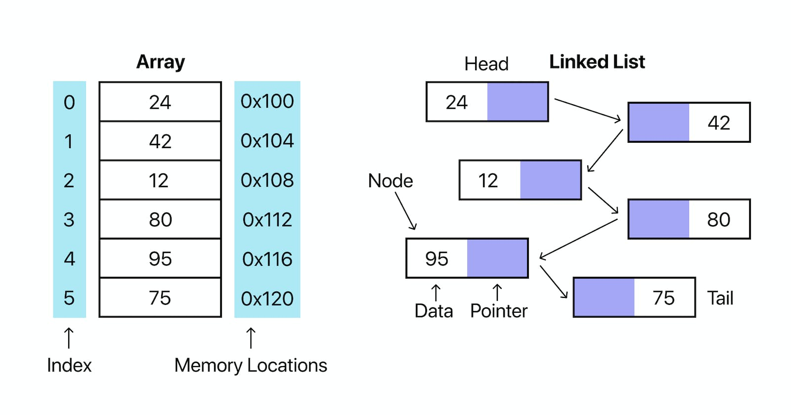
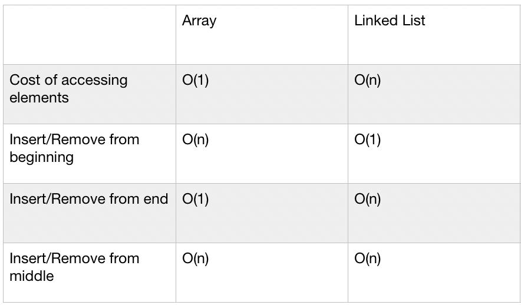

# Linked List 

# Introduction 
When we learn programming, the first data structure we encountered is the list. In Python, we can insert values into a list and for each element in the list there is a index associated with it. Here, we are going to discuss another data structure which is called *Linked list*. The fundamental difference between a list and a linked list is that for linked list it does not have index associated with the elements. 


  *Comparison between an array and a linked list ([reference](https://blog.garybricks.com/a-beginners-overview-of-linked-lists-in-python))*


 # Operations Of Linked List 


 *Comparison of array and linked list in operations' time complexity ([reference](https://medium.com/@mckenziefiege/arrays-linked-lists-and-big-o-notation-486727b6259b))*


 # Construction of Linked List

  *Schematic representation of a linked list ([reference](https://www.geeksforgeeks.org/data-structures/linked-list/singly-linked-list/))*

 ## Node Constructors 

 ```python

 # In this case we create a single node 
 # The head and tail also points at that single node 
class Node: 
    def __init__(self, value):
        self.value = value 
        self.next = None 
    
class LinkedList: 
    def __init__(self, value):
        new_node = Node(value)
        self.head = new_node
        self.tail = new_node 
 ```


 ## Append Nodes 


 ```python 
class LinkedList: 
    def __init__(self, value):
        new_node = Node(value)
        self.head = new_node
        self.tail = new_node 

    def append(self, value): 
        

 ```