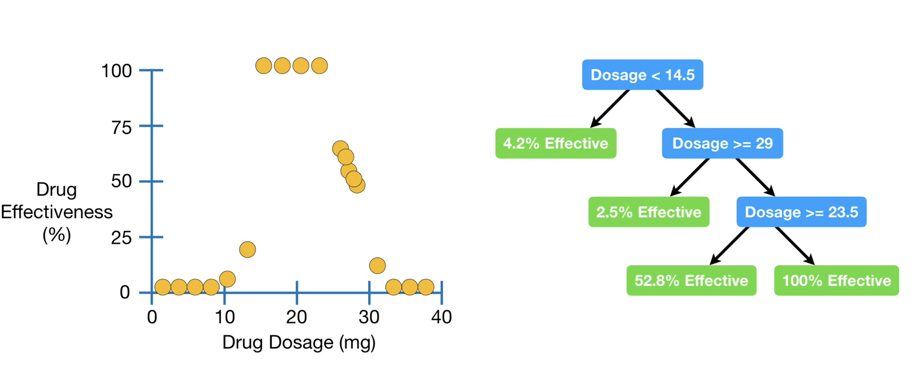

# CS229 - Tree-Based Methods and Ensemble Method 

# Introduction 
In this note I will focus on the tree-based methods such as decison and regreesion trees, and further investigate the ensemble methods such as **bagging** and **boosting**.

# Decision Trees 

A decision tree is a powerful and intuitive algorithm for prediction and classification. The decision tree algorithm segments the entire predictor space into several non-overlapping regions. In this section, we are going to investigate the **regreesion tree** and **classification tree** models. 

There are three major components in a decision tree
* Root Node: The toppest node of the tree 
* (Internal Nodes): the nodes which specify the partition conditions of the feature space
* Leaf Nodes: Node that do not have any children, which specify the outcomes of the partitions

In regression tree, each leaf represents a numeric value. In contrast, for classification tree the leafs are represented by true or false, or discrete categories. 

## Regression Trees 
 *Fig(1). The three-region partions for the Drug dataset from the StatQuest video*

To get the intuition behind the regression tree, let's begin with a drug dataset and try to predict the drug effectiveness for different dosages. Consider the root node (i.e. $\text{Dosage}<14.5$), the leaf node 4.2% Effectiveness is computed by averaging the 6 observations of  drug effectiveness where the dosage is less than 14.5. Similarly, for the internal node $\text{Dosage} \geq 29$, the leaf node is computed by averaging the four rightmost observations in the training data, resulting in $2.5 \%$ effective. The other internal node $\text{Dosage} \geq 23.5$ restricts our attention to the obseration where $\text{Dosage} \geq 14.5$ **and** $\text{Dosage} < 29$ **and** $\text{Dosage} \geq 23.5$, which are the five observation in the right-middle (i.e. $52.8 \%$ effective). Lastly, the remaining leaf node is $100 \%$ effective. Therefore, the regreesion tree model partition of whole feature space into four non-overlapping regions and the predicted drug effecitveness is the mean effecitveness of the corresponding regions. This example is simple since we can predict the effecitveness by looking at the left plot in Fig(1). However, when there are more features such as sex and age, we cannot see the relationship directly by looking at the data points and regreesion tree will be useful in such a case.

As a learning algorithm, the regreesion tree should learn the appropriate conditions of paritioning the feature space. 

## Classification Trees 

# Random Forests

# Extreme Gradient Boosting (XGBoost)

# Reference 
* [StatQuest with Josh Starmer: Regression Trees, Clearly Explained!!!](https://www.youtube.com/watch?v=g9c66TUylZ4&t=849s)
* [CS229 Fall2018 Lecture10](https://youtu.be/wr9gUr-eWdA)
* https://xgboost.readthedocs.io/en/stable/tutorials/model.html
